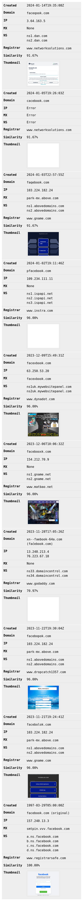

# freed.sh

A proof-of-concept shell script for early detection of lookalike domain utilized in a business email compromise or third-party compromise.

```help
$ ./freed.sh -h
Usage: freed.sh [OPTION]... [DOMAIN]
Find lookalike DOMAIN created in the last PERIOD and send result to RECIPIENT.

positional argument
  DOMAIN        target domain name

options
  -d DEFANG     defang character/string, e.g. '·' (U+00B7), '[.]' (default)
  -e ENGINE     permutation engine, e.g. dnstwist, urlcrazy, urlinsane (default)
  -h            display this help and exit
  -i INCLUDES   include domain(s) separated by comma in the operation
  -k            keep HTML result and do not send email
  -p PERIOD     time period to look back, e.g. 30d, 24h (default)
  -s RECIPIENT  send email to recipient, e.g. <your.gmail.account@gmail.com> (default)
  -t            display thumbnail in HTML result
  -x            display internationalized domain name (IDN) in HTML result
```

## Premise

To pull off an attack or to achieve action on objectives in a business email compromise or third-party compromise, an adversary must be tactically placed in the middle of email communications between an organization and the counter party, also known as man-in-the-email attack. A necessary condition for this attack to take place is to register new domains or to update expired ones that look like the domains of the organization and its counter party, which to the untrained eye, especially a [homoglyph](https://en.wikipedia.org/wiki/Homoglyph) attack, may be difficult to spot in an email.

The idea is simple.

It makes no sense to detect newly registered domains that looked like the domains of the counter parties since that number could easily fall into hundreds, if not more, an unmanageable situation for a large organization. The focus should be placed on detecting newly registered domains that looked like the organization instead.

The script can then be put in a `crontab` to run every day, say at 12AM UTC to find lookalike domains in the last 24 hours and send an email alert to a recipient if there's a hit.

The script uses `parallel` to speed things up, which takes no more than three minutes in a single vCPU virtual machine running Kali Linux.

### Difference between a parked domain and a weaponized domain

| Domain     | Created | MX Record                          |
|:-----------|:--------|:-----------------------------------|
| Parked     | Recent  | No                                 |
| Weaponized | Recent  | Yes (free email hosting providers) |

### Dependencies

The script depends on the following programs:

1. [dig](https://www.isc.org/download/)
2. [dnstwist](https://github.com/elceef/dnstwist)
3. [parallel](https://www.gnu.org/software/parallel/)
4. [sendemail](https://github.com/mogaal/sendemail)
5. [urlcrazy](https://github.com/urbanadventurer/urlcrazy)
6. [urlinsane](https://github.com/ziazon/urlinsane)
7. [whois](https://github.com/rfc1036/whois)

You should be able to get these programs from your Linux distribution.

### Permutation

You can choose a permutation engine from three permutation engines: `dnstwist`, `urlcrazy` or `urlinsane` (default).

### Send email from the script

To send an email alert to a recipient, you need to sign up for a SMTP service.

Gmail SMTP service is recommended because the `gmail.com` domain would pass SPF, DKIM and DMARC checks to deliver the email alert to a recipient (or yourself for testing). The step-by-step instructions to set up Gmail SMTP service is beyond the scope of this README.

## Example

Running `freed.sh` on `facebook.com` to look back 30 days from the time of script run (2023-12-08T03:50:55Z), with the following options:

* `-d`. Use defang character `․` (one dot leader) instead of the default `[.]` to save space.
* `-i`. Include the original domain for comparison.
* `-k`. Keep HTML result and do not send email.
* `-t`. Display thumbnail in HTML result.
* `-x`. Display internationalized domain name in HTML result to expose homoglyph attacks.

```demo
$ ./freed.sh -d․ -i facebook.com -k -p30d -t -x facebook.com
[2023-12-08T03:50:55Z] freed.sh has started.
[2023-12-08T03:50:55Z] Running `urlinsane' on "facebook.com"...done
[2023-12-08T03:51:09Z] Running `whois' on "facebook.com" (2844 variations)...done
[2023-12-08T03:52:38Z] Sorting result by timestamp...done
[2023-12-08T03:52:38Z] Creating thumbnails...done
[2023-12-08T03:53:28Z] Formatting result to HTML...done
[2023-12-08T03:53:28Z] Result in file "facebook.com.insane.html"
```

The result is sorted in descending order (youngest to oldest) by the domain creation date/time. 

RR stands for Registrar, and is shown as the Registrar's URL, if any, from WHOIS.


